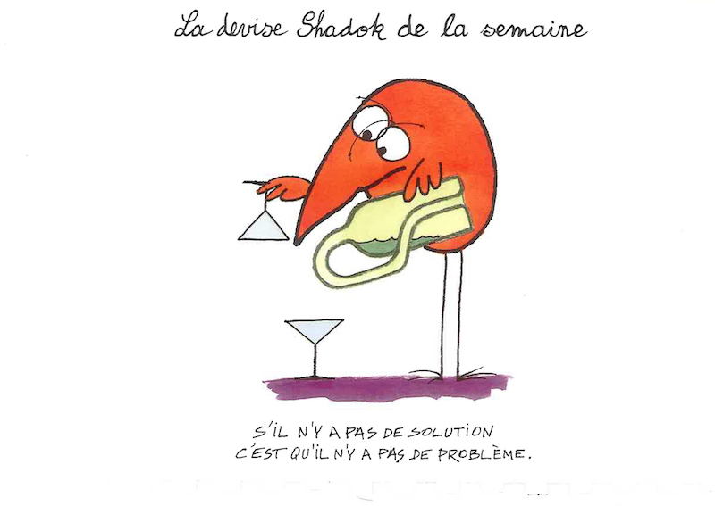
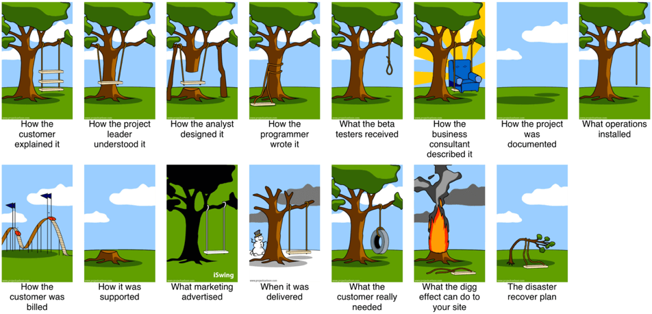
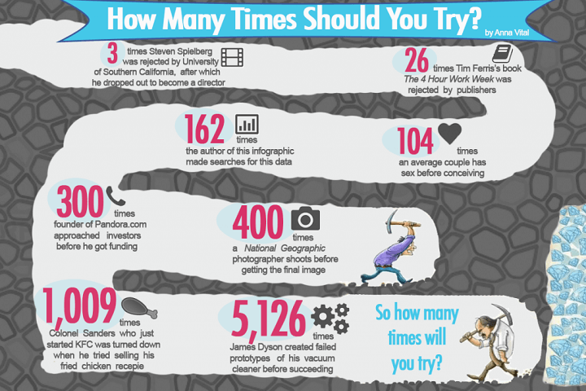
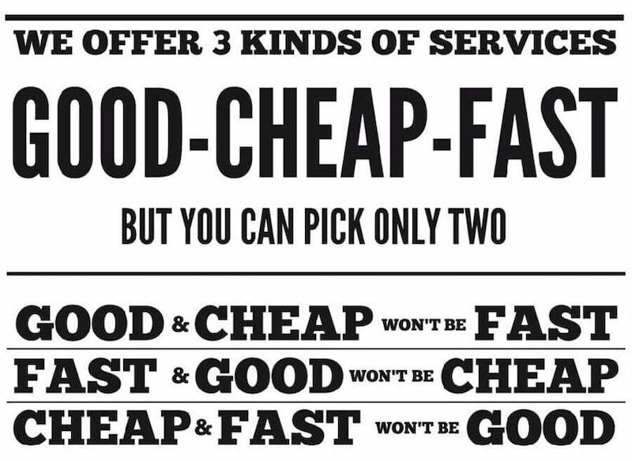

# Génie logiciel

[Vincent Boutour](https://vibioh.fr) - [@ViBiOh](https://github.com/ViBiOh)

Master MIAGE Paris Descartes, 2011 👴

Senior Software Engineer, [Datadog 🐶](https://www.datadoghq.com)

## Définition

Qu'est-ce que le génie ?

##

> La personne qui exauce vos voeux ?

`¯\_(ツ)_/¯`

##

« Démon qui préside à la conception »

> Wiktionnaire

##

« Aptitude de quelqu'un à concevoir des choses d'une qualité exceptionnelle »

> Larousse

## Objectifs du module

##

- Identifier un besoin
- Implémenter une solution
- Maîtriser le processus
- É-COU-TER

## Formaliser un besoin

> « Pas d'intérêt, pas d'action »

> [locus standi](https://fr.wikipedia.org/wiki/Intérêt_à_agir)

##

Maîtriser les enjeux, les problématiques :

- qualité
- coût
- délai, i.e. _Time To Market_
- processus
- performance
- User eXpérience
- sécurité

## Trouver et implémenter la solution

##

Écouter, comprendre et s'approprier le besoin.

##

Traduire le besoin en solution (i.e. ingénierie)

- faisabilité technique
- processus méthodologique
- contrainte (logistique, opérationnelle, etc.)
- anticipation des problèmes

##

> The Project Cartoon

##

> N'ayez pas peur d'échouer

##

> « La perfection est atteinte, non pas lorsqu'il n'y a plus rien à ajouter, mais lorsqu'il n'y a plus rien à retirer. »

> Antoine de Saint-Exupéry

## Travailler avec efficience

##

Maîtriser votre processus de développement.

##

- Découper la solution en tâches parallélisables
- Mutualiser les besoins communs
- Partager la même vision du produit
- S’entraider et… communiquer !

##

Pour produire de la technologie, utiliser de la technologie.

- Automatiser les tâches récurrentes

- Déployer le plus souvent possible

##

<iframe width="560" height="315" src="https://www.youtube.com/embed/0SM6t4F4CdY" frameborder="0" allow="autoplay; encrypted-media" allowfullscreen></iframe>
##
> « Vous voulez aller vite ? Alors prenez votre temps ! »

> Daniel Guillaume

## Résoudre [la triple contrainte](https://en.wikipedia.org/wiki/Project_management_triangle)

##

##

Le **génie logiciel** cherche à faire un « _**bon**_ » produit.

##

Conforme

> Le produit répond au besoin de l'utilisateur.

##

Maintenable

> Le code est compréhensible par mes pairs.

##

Testable

> Le produit est sûr et ne régresse pas.

##

Réutilisable

> Le code est modulaire et limite ses adhérences.

##

Documenté

> Le produit, contexte et/ou code sont expliqués.

##

Performant

> Le produit s'exécute promptement sur la volumétrie cible.

## Écouter

##

Faire un produit n'est pas complexe en soi, c'est l'environnement dans lequel vous le faites qui joue en votre défaveur.

##

L'informatique est une science qui va très vite, ce qui est _hype_ aujourd'hui sera obsolète demain.

##

L'utilisateur a soif de nouveautés, se trouve dans un environnement concurrentiel, et son besoin est sans cesse réajusté.

##

Livraisons très fréquentes, voire constantes.

##

Prendre en compte les retours utilisateurs et... leur faire un retour !

> Rewarded feedback

##

> L’imagination est plus importante que le savoir.

> Albert Einstein

## Littérature

- [The Pragmatic Programmer](https://isbnsearch.org/isbn/9780201616224), _Andrew Hunt & David Thomas_
- [Clean Code](https://isbnsearch.org/isbn/9780132350884), _Robert C. Martin_
- [Rework](https://isbnsearch.org/isbn/0307463745), _Jason Fried & David Heinemeier Hansson_ ([TED](https://www.ted.com/talks/jason_fried_why_work_doesn_t_happen_at_work))
- [Linchpin](https://isbnsearch.org/isbn/9780749953355), _Seth Godin_
- [Liberté & cie](https://isbnsearch.org/isbn/2081379511), _Isaac Getz_
- [La vérité sur ce qui nous motive / Drive en V.O.](https://isbnsearch.org/isbn/208137952X), _Daniel H. Pink_ ([TED](https://www.ted.com/talks/dan_pink_on_motivation))

## Liens divers

- [Speed in software development](https://www.targetprocess.com/articles/speed-in-software-development/)
- [Software development](https://medium.freecodecamp.org/learn-the-fundamentals-of-a-good-developer-mindset-in-15-minutes-81321ab8a682)
- [GOTO 2015 - Space Shuttle](https://www.youtube.com/watch?v=AyrRoKN_kvg)
- [YAGNI Cargo](https://codeahoy.com/2017/08/19/yagni-cargo-cult-and-overengineering-the-planes-wont-land-just-because-you-built-a-runway-in-your-backyard/)
