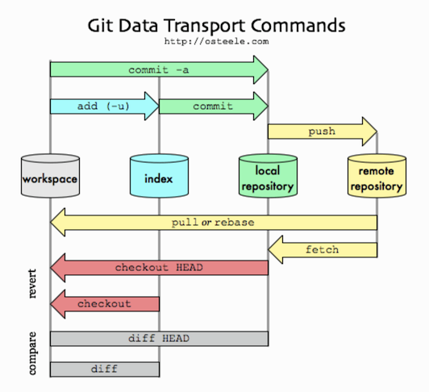

# Git

* Gestion de configuration
* Fonctionnement *à la ligne*
* Décentralisé, pas *forcément* besoin d'un serveur
* Branches, *cherry-pick*, tag, fusion

## Création d'un *repository* en local

`git init`

## Connaître l'état de la copie locale

`git status`

## Ajouter un fichier au système de version

`git add <nom_du_fichier>`

### En mode interactif pour ajouter seulement ceux souhaités

`git add -i`

### En mode interactif pour ajouter seulement les sous-parties

`git add -p`

### Annuler les modifications locales

`git checkout -- <nom_du_fichier>`

`git restore <nom_du_fichier>`

### Annuler les modifications déjà ajoutées

`git reset HEAD -- <nom_du_fichier>`

`git restore --staged <nom_du_fichier>`

### Créer une branche à partir de la branche courante

`git checkout -b <nom_de_la_branche>`

`git switch --create <nom_de_la_branche>`

### Changer de branche

`git checkout <nom_de_la_branche>`

`git switch <nom_de_la_branche>`

### Mettre de côté ses modifications

`git stash`

### Réappliquer les modifications mises de côté

`git stash pop`

## Valider localement ses modifications

`git commit -m "commentaire de votre commit"`

## Voir l'historique des commits

`git log`

## Voir le détail d'un commit

`git show <commit-sha1>`

## Créer une clé SSH

> ssh-keygen -t ed25519 -a 100 -C "$(whoami)@$(hostname)" -f "${HOME}/.ssh/id_ed25519"

## Ajouter un remote

> git remote add origin
> git@github.com:ViBiOh/l3miage.git

## Pousser ses modifications sur le serveur

`git push`

### En précisant la destination, la branche

`git push <nom_du_remote> <nom_de_la_branche>`

> git push origin main

### En précisant la destination, la branche, la référence locale

`git push <nom_du_remote> <commit_ref>:<nom_de_la_branche>`

> `git push origin HEAD:main`

Ne pas oublier le **HEAD** car `git push origin :main` supprime la branche

## Récupérer les modifications du serveur

`git pull`

### En précisant la source, la branche

`git pull <nom_du_remote> <nom_de_la_branche>`

> git pull origin main

### Récupérer les modifications d'une autre branche sur la sienne

Par "en dessous"

`git pull --rebase <nom_de_la_branche_source>`

Par "au dessus"

`git pull --rebase=false <nom_de_la_branche_source>`

## Cloner un repository existant

`git clone <url_du_repo>`

via HTTP, pour du public mais pas idéal pour travailler.

> git clone
> http://github.com/ViBiOh/l3miage.git

via SSH, pour du public et privé, plus sûr.

> git clone
> git@github.com:ViBiOh/l3miage.git

# Références

* [Un guide interactif et visuel](http://git-school.github.io/visualizing-git/#free)
* [La documentation officielle](http://git-scm.com/book/fr/v1)
* [GitFlow](http://nvie.com/posts/a-successful-git-branching-model/) or [GitHub Flow](https://docs.github.com/en/get-started/quickstart/github-flow)
* [Configuration](https://delicious-insights.com/fr/articles/configuration-git/)
* [Merge vs Rebase](https://medium.com/@porteneuve/getting-solid-at-git-rebase-vs-merge-4fa1a48c53aa)
