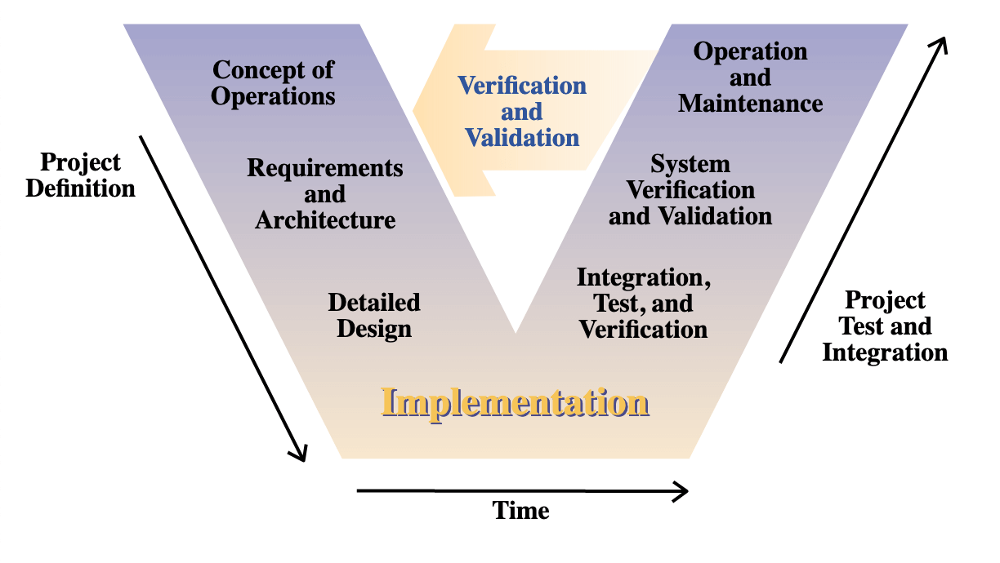
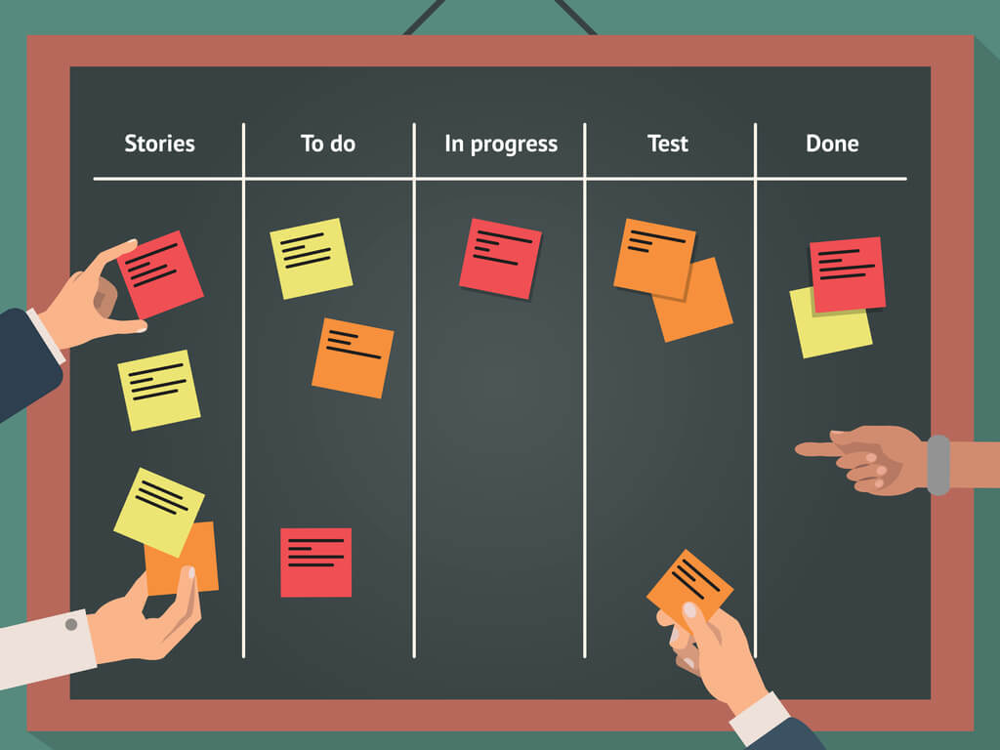
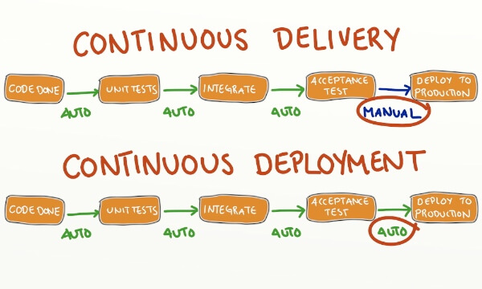

# Méthodologies & principes

> « Nine women can't make a baby in one month. »

> Frederic Brooks

L'informatique, et le développement de logiciels en particulier, sont bien souvent un laboratoire d'essais pour les méthodes de management et/ou de gestion de projet.

## Cycle V

Très contractuel et procédurier : un cahier des charges initial, un cahier de recette final.

Souvent utilisé dans le cadre de "forfait" en SSII.

Crée un effet « tunnel » car chaque tâche dépend de la précédente, sans validation de l'utilisateur.

## Agile - Scrum

Processus itératif où l'on présente fréquemment l'avancée du produit à l'utilisateur.

Risque bien moins grand de dévier du besoin réel, possibilité de le réajuster en cours de développement.

Tout est *timeboxé*. Chaque cérémonie de la méthode Scrum a une durée qu'il faut respecter. On va à l'essentiel.

Si vous entendez parlez de **Sprint**, de **burn-down chart**, de **daily standup**, vous êtes dans une équipe agile.

... ou alors si vous voyez des montagnes de Post-it ® sur un des bureaux !

La qualité vous fait peur ?

Tant mieux : on ne négocie pas avec ~~les terroristes~~ la qualité.

[Devenir agile en 15 min](https://www.youtube.com/watch?v=3qMpB-UH9kA)

## Méthode Kanban

Ne pas "trop" prévoir, car, par définition, une prévision est incertaine.

"Flux tiré" par la demande, on lit le tableau de droite à gauche.

Limiter l'encours afin de favoriser la vélocité.

> « Stop starting, start finishing. »

C'est un premier pas vers le _lean manufacturing_

Références :

- [Trello](https://trello.com)
- [La méthode Kanban, L'approche en flux pour l'entreprise agile](https://isbnsearch.org/isbn/9782100781058)

## [Given-When-Then](https://en.wikipedia.org/wiki/Given-When-Then)

**Comme** je suis connecté, **quand** je vais sur mon profil, **je peux** vérifier l'exactitude de mes informations.

**En tant que** client, **je veux** pouvoir consulter mon profil **afin de** vérifier l'exactitude de mes informations.

Phrases courtes permettant de définir une fonctionnalité, un besoin, un bug, etc.

Attention à correctement les organiser pour que cela reste maintenable et lisible.

> La carte n'est pas le territoire.

## Cahier des charges

Cadrage & périmètre

> Pourquoi et dans quelle mesure faisons nous ce produit/projet ?

Expression fonctionnelle du besoin

> Quelles sont toutes les règles que le produit/projet doit respecter ?

Méthodes & contraintes

> Comment allons nous travailler au sein de ce produit/projet ?

Délais et parties prenantes

> À qui et quand rendre compte ?

## CI / CD

> Continuous Integration / Continuous Delivery

L'objectif de l'entreprise est de réduire le *Time To Market* (T.T.M.) et donc pour la R&D le *Time To Ship*.

On livre toujours du code qu'on assume : exempt de bugs, performant...

De qualité !

> [Crip's blog](https://blog.crisp.se/2013/02/05/yassalsundman/continuous-delivery-vs-continuous-deployment)

A chaque erreur détectée lors du processus, l'intégration continue doit être en mesure d'identifier les nouveaux *commits* depuis le dernier succès et d'en avertir les parties prenantes.

## Feature Flipping

Désactiver des fonctionnalités à la volée

* en cas de problèmes
* pour faire du [*A/B testing*](https://en.wikipedia.org/wiki/A/B_testing)
* pour gérer la montée en charge

## Communication

> Seul on va plus vite, ensemble on va plus loin.

Partager votre vision
* projet
* produit
* équipe
* environnement

Faire de la veille, assister à des conférences, des *meetups*, des salons, ...

> [« Stay hungry, stay foolish. »](https://youtu.be/UF8uR6Z6KLc) - Steve Jobs

Discuter des implémentations, technologies, actualités.

En méso-économie, on ne peut ignorer un évènement. Même si un domaine ne vous intéresse pas, il vous impactera directement ou indirectement.

Être bon communicant passe par de bons outils

* [Notion.so](https://www.notion.so), WiKi, Readme, etc.
* [Slack](http://www.slack.com), [Zulip](https://zulip.com), [Discord](https://discordapp.com), IRC
* Réseaux sociaux, [reddit](https://reddit.com), [HackerNews](https://news.ycombinator.com)
* Animer l'équipe et acquérir le *team-spirit*

## Lois du travail en organisation

Travailler dans des organisations implique de connaître quelques lois empiriques qui les régissent.

### Principe de Peter #1

> Tout employé tend à s'élever à son niveau d'incompétence...

### Principe de Peter #2

> ... Avec le temps, tous les postes d'une entreprise sont occupés par des incompétents.

### Principe de Dilbert

> Les gens les moins compétents sont systématiquement affectés aux postes où ils risquent de causer le moins de dégâts : ceux de managers.

### There ain't no such thing as a free lunch

Gratuit ne veut pas dire sans valeur

> On n'a rien sans rien

> "Free beer" vs "free speech"

### Loi de Fraisse

> Le temps est subjectif : ce qui est plaisant passe vite, ce qui est désagréable semble durer.

### Loi de Parkinson

> Le travail se dilate jusqu'à occuper tout le temps qui lui est dévolu.

### Loi d'Illich

> Après un certain temps de travail, la productivité décroît. La pause devient nécessaire.

### Loi de Murphy

> Si quelque chose peut arriver, alors ça arrivera.

## Autres principes

### Les cinq « pourquoi »

> Pourquoi ? Pourquoi ? Pourquoi ? Pourquoi ? Pourquoi ?

### CQQCOQP

> Combien ? Qui ? Quand ? Comment ? Où ? Quoi ? Pourquoi ?

### Loi de Pareto

> Règle des 80 - 20

### Principe du *boy-scout*

> *Leave the campground cleaner that you found it.*

* Amélioration continue du logiciel

* Pas de coupable, pensez en équipe

> No finger pointing

> No name, no blame, no shame

### YAGNI

> You Aren’t Gonna Need It

## Dette technique

Analogie faite par Ward Cunningham qui applique le principe d'une dette financière au développement logiciel.

Le capital est votre base de code, les intérêts sont :
* les bugs
* les *quick and dirty*
* l'obsolescence

Chaque ajout de fonctionnalité vient modifier l'application, il faut donc veiller à refactorer au fil de l'eau pour ne pas empiler du code.

> e.g. Un `if/else` peut vite se transformer en enchaînement disgracieux : faire un `switch`

Enfin, l'environnement évolue sans cesse, les modèles, les méthodes, les outils, etc. Il faut donc veiller à ne pas avoir des architectures trop vieilles, devenues inmaintenables.

[Dette technique et entropie du logiciel](https://www.youtube.com/watch?v=VKe9EE4MUxk)

[Technical debt by Martin Fowler](https://martinfowler.com/bliki/TechnicalDebtQuadrant.html)

## Ne pas réinventer la roue

Utiliser ce qui existe quand cela répond à votre besoin

En combinant des outils, on peut en créer d'autres. Philosophie unix.

e.g. la stack ELK pour analyser vos logs : ElasticSearch Logstash Kibana

> Eviter le "too busy to improve"

## *Keep It Simple, Stupid* - KISS

> Pourquoi faire compliqué quand on peut faire simple ?

Il est parfois compliqué de faire simple en appliquant les *patterns* de programmation

## *Problem Exists Between Chair And Keyboard* - PEBKAC

> Le plus grand virus informatique est l'interface clavier-chaise.

## *Read The Fucking Manual* - RTFM

* La réponse est bien souvent dans la documentation
* La réponse est sur [Google](http://lmgtfy.com/?q=google.fr&l=1) / [StackOverflow](http://lmgtfy.com/?q=stacksverflow.com&l=1)
* La réponse est dans les *issues* GitHub
* La réponse est 42

S'il y a vraiment un bug (i.e. après avoir lu la documentation), ouvrez un ticket !

Contribuez, corrigez, ameliorez : appropriez-vous vos outils
